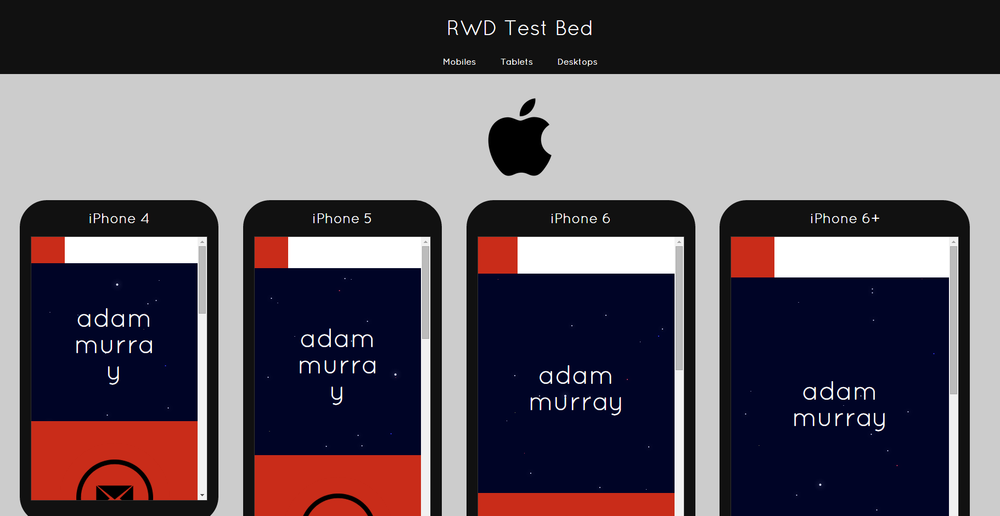
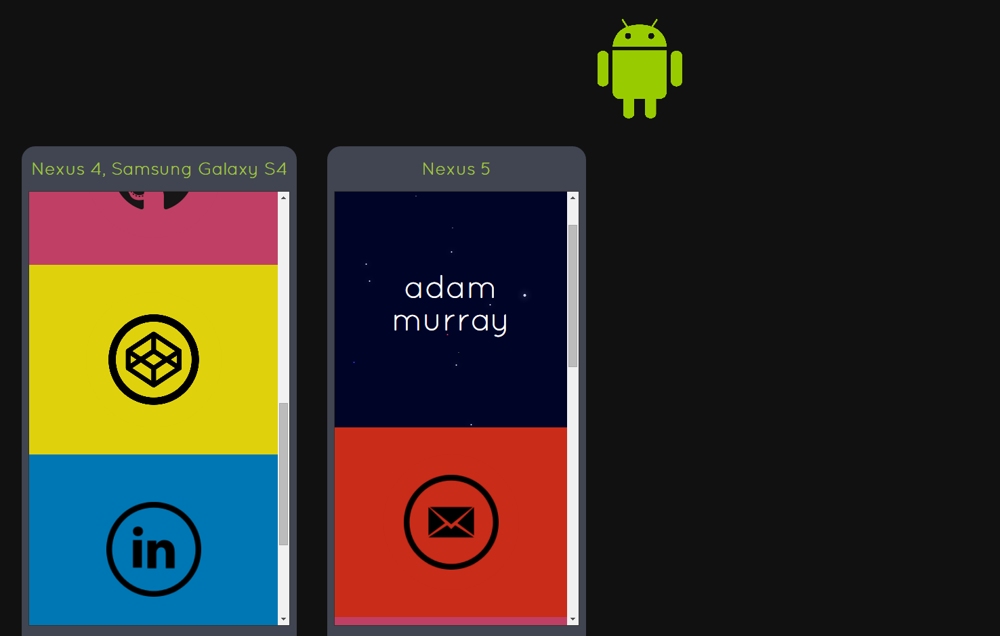
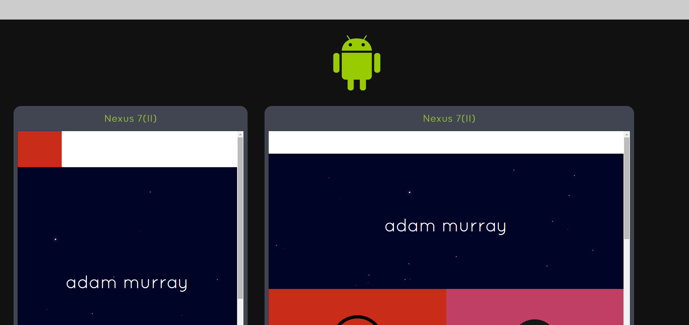

# Testify
## The responsive web design test bed

**IMPORTANT: currently working on a simple way to run the project which should be
cross-platform and work for all users. I'll remove this notice when that is done.**

Welcome to **Testify**!

Testify is a little different from other responsive design tools out there. Most
tools are hosted online, display using only one form factor (i.e. smartphone) at
at time, and can only display websites already hosted online.

Testify is run locally on your machine, and is primarily used for testing your
locally hosted website. Internet hosted websites can also be displayed, in theory,
but for now only a website hosted locally on a specific port can be tested. This
will be adjustable in future releases.

In addition, the main purpose of Testify is to present multiple form factors at once,
in order to quickly see any inconsistencies between different screen sizes. For example,
you may have a responsive site that looks great on a Samsung 4, but which looks a
bit squashed or uneven on an iPhone 4.

Basically, if you're annoyed with constantly having to switch between form factors
using the Chrome mobile developer tools, then Testify is for you.

So, come try out Testify. See if it's for you. Tell me what you'd like to see in
future releases. Right now you can clone the project and run it using the *Usage*
tutorial below. However, running it will be simpler in future.

Thanks for reading and checking out Testify!

## Features

Current features include:

* 6 mobile form factors
  * Apple
    * iPhone 4
    * iPhone 5
    * iPhone 6
    * iPhone 6+
  * Android
    * Nexus 4 / Samsung Galaxy 4
    * Nexus 5


* 2 tablet form factors, each in portrait and landscape orientation
  * Apple
    * iPad 1 / 2
  * Android
    * Nexus 7 (II)


* 1 laptop form factor
  * 1280 x 800 screen size (generic notebook)

New features will be continually added to the project. See Future Improvements below.

## Usage

### Command Prompt

**Note: `nodeJS` will need to be installed on your system for the node modules to run.
It can be downloaded [here](https://nodejs.org/download/).**

This first option involves running commands directly on the CLI, and should work
on all operating systems. A second option
below is also available, which involves double-clicking on Windows batch files.
This is, of course, a Windows only option; however, Linux bash files will be added
soon.

First of all, as stated above, nodeJS will need to be downloaded onto your machine.
After it is installed, the `http-server` module must be installed **globally** so
that it can be run from the command line. This can be done via the following command
(the `-g` flag is for global installation):

```bash
> npm install http-server -g
```

Next, run the project you want to test on `localhost` using port `8080`.
Then, to run the test bed, navigate to the root directory of the test bed
(`RWDTestBed`) and run the `http-server` node module using:

```bash
> http-server -p [chosen-port]
```

Finally, navigate to the test bed by typing into the browser:

```
http://localhost:[chosen-port]
```

### Batch Files (Windows)

[This option also involves installing `nodeJS` and `http-server` globally as described
above in the *Command Prompt* section. Please follow these instructions first before
using the batch files.]

Alternatively, the test bed can be run by double-clicking on the batch file
`RunRWDTestBed_Windows.bat`. This will run the `http-server` in the current directory
using port `8000`, open a browser tab/window, and navigate to `http://localhost:8000`.

As in the first option, the project you want to test must be running on `localhost`
port `8080`. This will be configurable in future.

## Screenshots

### Apple mobiles


### Android mobiles


### Android tablets


## Future Improvements

* Desktop form factors

* More realistic shaped surround styles

* Screen features for various form factors such as info bars and buttons which are
constantly on screen, in order to make view more realistic

* Ability to choose which site to show via a form when the site is first loaded

* Ability to run site from a shortcut or link

* Improved styles

* Ability to create a new kind of form factor from within the app
